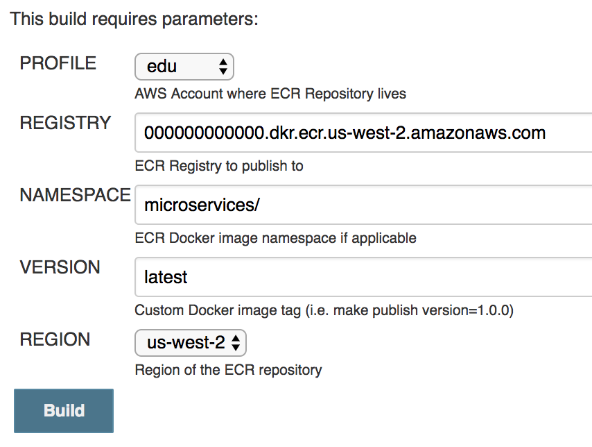

# golang-test-microservices
Build the example microservices for https://github.com/andymotta/ecs-alb-efs

## Microservices
Examples borrowed from: https://github.com/awslabs/ecs-refarch-cloudformation/tree/master/services and adapted for ECS with ALB.  

Product web talks to a product api  for products listing.

### Prerequisites
- A working golang installation on the build server

### Running locally
`make run`
Docker host ports will be dynamically generated
- product-web is available at /
- products is available at /products

## Build and Push to ECR
### Jenkins Configuration

Alternatively to latest, set `APP_VERSION=${GIT_COMMIT}`

Inline Build Script:
```bash
sudo chown -R jenkins $WORKSPACE
export PATH=$PATH:/usr/local/go/bin
export GOPATH=$WORKSPACE/go
export GOBIN=$GOPATH/bin
cd products
go get
cd ../product-web
go get
cd ..
make all SERVICE=product-web
make all SERVICE=products
```

### Help
`make help`
